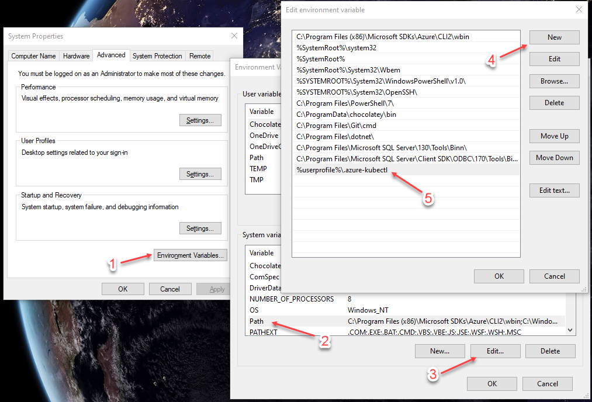
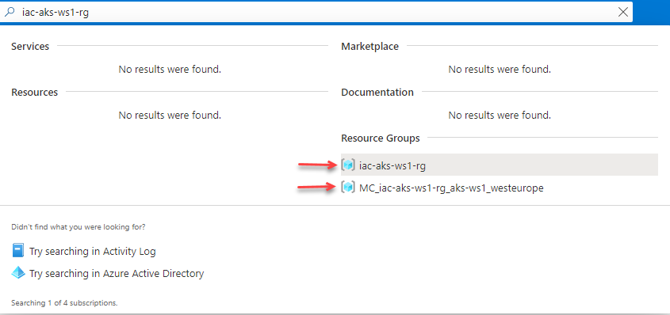

# lab-01 - AKS setup

## Estimated completion time - 15 min

To start learning and experimenting with Kubernetes concepts, commands and operations, we need to provision Azure Kubernetes Service (AKS). There are multiple ways you can provision AKS and there will be dedicated workshop covering this topic in details. But for this workshop we will use the simplest possible option - `az cli`. AKS as a resource is not free and the compute power will come with some costs. We will use the smallest Virtual Machine size for our nodes and we will use only one node. We will also delete AKS cluster when we are finished with workshop. Here is the list of resources we need to provision:

* Resource Group
* Azure Container Registry (ACR)
* Azure Kubernetes Service (AKS)


## Goals

* Provision resource group for all resources needed during the workshop
* Provision Azure Container Registry (ACR)
* Provision Azure Log Analytics Workspace
* Provision Azure Kubernetes Service (AKS) and integrate it with ACR
* Install `kubectl` command 
* Connect to AKS cluster
* Use `kubectl` and get list of nodes and namespaces

## Task #1 - create AKS resources

First, you need to create resource group. I suggest we all use the same resource group name - `iac-aks-ws1-rg` so it will be easier to troubleshoot thing later if needed. 

```bash
# Create new resource group iac-aks-ws1-rg
az group create -g iac-aks-ws1-rg -l westeurope
```

Next, create Azure Container Registry. ACR name should be globally unique, therefore I suggest that we use the following naming convention: `iacaksws1<YOU-NAME>acr`, so for example for me it will be  `iacaksws1evgacr`.

```bash
# Create Azure Container Registry iacaksws1<YOU-NAME>acr
az acr create -g iac-aks-ws1-rg -n iacaksws1<YOU-NAME>acr --sku Basic
```

Provision Log Analytics Workspace. LA workspace name must be globally unique, therefore I suggest that we use the following naming convention: `iac-aks-ws1-<YOU-NAME>-la`, so for example for me it will be  `iac-aks-ws1-evg-la`.

```bash
# Create Azure Log Analytics iac-aks-ws1-<YOU-NAME>-la
az monitor log-analytics workspace create -g iac-aks-ws1-rg -n iac-aks-ws1-<YOU-NAME>-la
```

Finally, provision AKS. Let's all us use the same cluster name - `aks-ws1`

```bash
# get workspace resource id
az monitor log-analytics workspace show -g iac-aks-ws1-rg -n iac-aks-ws1-<YOU-NAME>-la --query id -o tsv
"/subscriptions/8878beb2-5e5d-4418-0000-783674eea324/resourcegroups/iac-aks-ws1-rg/providers/microsoft.operationalinsights/workspaces/iac-aks-ws1-<YOU-NAME>-la"

# Provision new AKS cluster
az aks create --resource-group iac-aks-ws1-rg --name aks-ws1 --node-count 1 --kubernetes-version 1.19.6 --attach-acr iacaksws1<YOU-NAME>acr --generate-ssh-keys --enable-addons monitoring --workspace-resource-id "<WORKSPACE-ID>"
```

## Task #2 - install kubectl

To manage a Kubernetes cluster, you use `kubectl`, the Kubernetes command-line client. To install kubectl locally, use the [az aks install-cli](https://docs.microsoft.com/en-us/cli/azure/aks?view=azure-cli-latest&WT.mc_id=AZ-MVP-5003837#az_aks_install_cli) command. 

```bash
# Install kubectl
az aks install-cli
```

If you are using PowerShell, you need to update system PATH environment variable and add new item for `%userprofile%\.azure-kubectl`. 



* Open the Start Search, type in `env`, and choose `Edit the system environment variables`
* Click the `Environment Variables…` button.
* Select `Path` variable under `System variables` section
* CLick `Edit...`
* Click `New` and set variable to `%userprofile%\.azure-kubectl`

You need to reset your PowerShell (and cmd) session(s) for change to take effect.

If you are running on WSL, you may need to use `sudo` , in this case run 

```bash
# Install kubectl using sudo
sudo az aks install-cli
```

For a complete list of kubectl operations, see [Overview of kubectl](https://kubernetes.io/docs/reference/kubectl/overview/).

To configure `kubectl` to connect to your Kubernetes cluster, use the [az aks get-credentials](https://docs.microsoft.com/en-us/cli/azure/aks?view=azure-cli-latest&WT.mc_id=AZ-MVP-5003837#az_aks_get_credentials) command. This command downloads credentials and configures the Kubernetes CLI to use them.

```bash
# Get access credentials for AKS
az aks get-credentials -g iac-aks-ws1-rg -n aks-ws1 --overwrite-existing
```

## Task #3 - verify the connection to your cluster

To verify the connection to your cluster, let's use the `kubectl get` commands to return a list of the cluster nodes and namespaces

```bash
# Get nodes
kubectl get nodes
NAME                                STATUS   ROLES   AGE     VERSION
aks-nodepool1-95835493-vmss000000   Ready    agent   6m24s   v1.18.14

# Get namespaces
kubectl get ns
NAME              STATUS   AGE
default           Active   7m56s
kube-node-lease   Active   7m58s
kube-public       Active   7m58s
kube-system       Active   7m58s
```

# Task #4 - check resources at the portal

If you now go to the Azure portal and search for `iac-aks-ws1-rg`, you will find that there are 2 resource groups listed in the search result.



`iac-aks-ws1-rg` is the one that we created, and the second one called `MC_iac-aks-ws1-rg_aks-ws1_westeurope` is created by Microsoft and it contains all AKS resources managed by Microsoft.

Navigate to `iac-aks-ws1-rg` resource group and you should see the following set of resources


## Useful links

* [Azure Container Registry documentation](https://docs.microsoft.com/en-us/azure/container-registry/?WT.mc_id=AZ-MVP-5003837)
* [Azure Kubernetes Service (AKS)](https://docs.microsoft.com/en-us/azure/aks/?WT.mc_id=AZ-MVP-5003837)
* [Quickstart: Deploy an Azure Kubernetes Service cluster using the Azure CLI](https://docs.microsoft.com/en-us/azure/aks/kubernetes-walkthrough?WT.mc_id=AZ-MVP-5003837)
* [Tutorial: Deploy and use Azure Container Registry](https://docs.microsoft.com/en-us/azure/aks/tutorial-kubernetes-prepare-acr?WT.mc_id=AZ-MVP-5003837)
* [Authenticate with Azure Container Registry from Azure Kubernetes Service](https://docs.microsoft.com/en-us/azure/aks/cluster-container-registry-integration?WT.mc_id=AZ-MVP-5003837)
* [az aks install-cli](https://docs.microsoft.com/en-us/cli/azure/aks?view=azure-cli-latest?WT.mc_id=AZ-MVP-5003837#az_aks_install_cli)
* [Overview of kubectl](https://kubernetes.io/docs/reference/kubectl/overview/)

## Next: setting up your shell for better AKS/kubectl experience

[Go to lab-02](../lab-02/readme.md)

## Feedback

* Visit the [Github Issue](https://github.com/evgenyb/aks-workshops/issues/2) to comment on this lab. 
