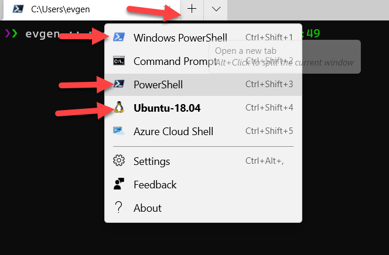
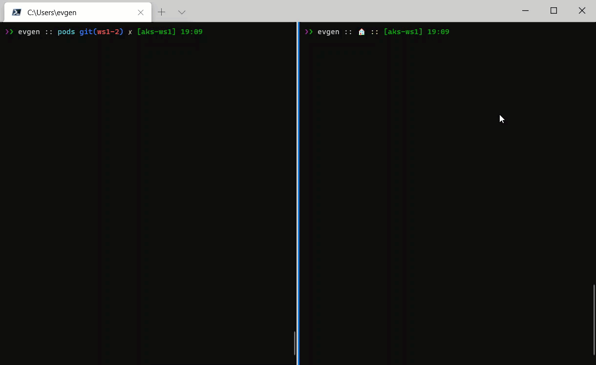

# lab-04 - Creating, managing and testing pods

## Estimated completion time - xx min

If you managed to solve all tasks and you still have some time, feel free to do labs marked as `Optional`. 

## Goals

* Learn how to run application at AKS
* Learn how to get list of pods
* Learn how to get detailed information about the pod
* Learn how to get pod description
* Learn how to delete pods
* Learn how to run pod as interactive shell for testing and debugging your apps
* Learn how to get logs from the pod
* Learn how to create pod from yaml definition file
* Learn how to use port forward to test pod

## Task #0 - (only for Windows users) - setting up Windows Terminal

For the most of the labs, I recommend you to use Windows Terminal, because it allows to split Terminal windows in two (and more) sessions. One will be be used to run all commands included into the labs. In the second window you will run `kubectl get ... -w` command in watching mode and you will get a realtime feedback about what kubernetes does behind the scene.

You can install Windows Terminal from the [Microsoft Store](https://aka.ms/terminal). When installed, start it, maximize it (so you have enough space) and select shell of your choice.



To split current window, enter `Shift+Alt+D` and it will split your current window either vertically or horizontally:


In the right session run the "watcher" command:

```bash
# Watch what happens with pods
kubectl get pods -w
```

This command will be running and watching all state changes inside the cluster in regards to pods. 

At the left session you run all commands from the labs. 



## Task #1 - run image from ACR in AKS

Now that we published several versions of out application images into ACR, and our AKS cluster is integrated with ACR, we can run our application inside the AKS

```bash
# Run pod app-a
kubectl run app-a --image iacaksws1<YOU-NAME>acr.azurecr.io/apia:v1
pod/app-a created
```

As you can see, Kubernetes reporting that `pod` `app-a` was created.

Now, let's run another version of application (tagged with `:1.0.0`), this time let's call it `app-b`

```bash
# Run pod app-b
kubectl run app-b --image iacaksws1<YOU-NAME>acr.azurecr.io/apia:1.0.0
pod/app-b created
```

## Task #2 - get information about pods

To get all pods, use the following command

```bash
# List all pods 
kubectl get pod
NAME    READY   STATUS    RESTARTS   AGE
app-a   1/1     Running   0          5h18m
app-b   1/1     Running   0          13s
```

as you can see, there are 2 pods running. Both have status `Running` and `Ready` column contains `1/1`, which means that 1 out of 1 pods are in `Running` state. 
To get even more information about pods, use `-o wide` flag

```bash
# List all pods with expanded (aka "wide") output
kubectl get po -o wide
NAME    READY   STATUS    RESTARTS   AGE     IP            NODE                                NOMINATED NODE   READINESS GATES
app-a   1/1     Running   0          5h21m   10.244.0.9    aks-nodepool1-95835493-vmss000000   <none>           <none>
app-b   1/1     Running   0          2m49s   10.244.0.10   aks-nodepool1-95835493-vmss000000   <none>           <none>
```

as you can see, now report contains additional information about pods, such as IP address and node name where pods were created.

## Task #3 - get detailed information about pod 

You can get information about one concrete pod by running 

```bash
# Get pod app-a
kubectl get po app-a
NAME    READY   STATUS    RESTARTS   AGE
app-a   1/1     Running   0          20h

# Note, I used `po` instead of `pod`. This is alias that you can use to save some keystrokes. Another alias is `pods` :)
# Get app-a pod with expanded (aka "wide") output
kubectl get po app-a -o wide
NAME    READY   STATUS    RESTARTS   AGE   IP           NODE                                NOMINATED NODE   READINESS GATES
app-a   1/1     Running   0          20h   10.244.0.9   aks-nodepool1-95835493-vmss000000   <none>           <none>

# Describe pod with verbose output
kubectl describe pod app-a
Name:         app-a
Namespace:    default
Priority:     0
Node:         aks-nodepool1-95835493-vmss000000/10.240.0.4
Start Time:   Wed, 03 Feb 2021 08:55:10 +0100
Labels:       <none>
Annotations:  <none>
Status:       Running
IP:           10.244.0.34
IPs:
  IP:  10.244.0.34
...

# Get pod app-a definition as YAML
kubectl get po app-a -o yaml
apiVersion: v1
kind: Pod
metadata:
  creationTimestamp: "2021-02-01T14:40:22Z"
  labels:
    run: app-a
...

# Get pod app-a definition json
kubectl get po app-a -o json
{
    "apiVersion": "v1",
    "kind": "Pod",
    "metadata": {
        "creationTimestamp": "2021-02-03T07:55:10Z",
        "name": "app-a",
        "namespace": "default",
        "selfLink": "/api/v1/namespaces/default/pods/app-a",
        "uid": "a87d3cac-9bd3-4061-9af0-2876a44c96b7"
    },
...    
```

## Task #4 - testing within cluster with interactive shell. Option #1

Quite often you need to test application from within your cluster. Because cluster is running inside it's own Virtual Network, nothing is accessible from your PC. 
Let's try to ping of the running `app-a|b|c` pods.

```bash
# Get pods IP addresses
kubectl get po -o wide
NAME    READY   STATUS    RESTARTS   AGE     IP            NODE                                NOMINATED NODE   READINESS GATES
app-a   1/1     Running   0          27h     10.244.0.9    aks-nodepool1-95835493-vmss000000   <none>           <none>
app-b   1/1     Running   0          21h     10.244.0.10   aks-nodepool1-95835493-vmss000000   <none>           <none>
app-c   1/1     Running   0          21h     10.244.0.11   aks-nodepool1-95835493-vmss000000   <none>           <none>

# try to ping `app-a`
ping 10.244.0.9

Pinging 10.244.0.9 with 32 bytes of data:
Request timed out.
```

How can we test our application? One common solution is to run a test pod that you can attach to and run interactive shell commands from inside the pod. There are several well known images for such a tasks, one of them called [busybox](https://busybox.net/), but the image we will use is [busyboxplus:curl](https://hub.docker.com/r/radial/busyboxplus). This is because it contains `curl` command that need for our testing. 

```bash
# Run pod as interactive shell
kubectl run curl -i --tty --rm --restart=Never --image=radial/busyboxplus:curl -- sh
# Here is prompt from withing the pod
[ root@curl:/ ]$ 

# Now, try to ping the same IP
[ root@curl:/ ]$ ping 10.244.0.9
PING 10.244.0.9 (10.244.0.9): 56 data bytes
64 bytes from 10.244.0.9: seq=0 ttl=64 time=0.134 ms
64 bytes from 10.244.0.9: seq=1 ttl=64 time=0.095 ms
64 bytes from 10.244.0.9: seq=2 ttl=64 time=0.094 ms
^C
--- 10.244.0.9 ping statistics ---
3 packets transmitted, 3 packets received, 0% packet loss
round-trip min/avg/max = 0.094/0.107/0.134 ms

# Exit from the pod
[ root@curl:/ ]$ exit
pod "curl" deleted
```

Couple of things to mention here:

1. As expected, IP address is now accessible from inside the pod. 
2. The `curl` pod was deleted when we exit. This is because of  `--rm` flag that tells Kubernetes to delete pod created by this command.

## Task #5 - delete pod

Now, let's delete `curl` pod. 

```bash
# delete single pod
kubectl delete pod curl
pod "curl" deleted
```

## Task #6 - deploy `apia` image using yaml pod definition 

Let's first delete all `app-a|b|c` pods from the cluster

```bash
# delete app-a|b|c pods
kubectl delete pod app-a app-b app-c
pod "app-a" deleted
pod "app-b" deleted
pod "app-c" deleted
```

Now, create new `app-a-pod.yaml` file with the following content

```yaml
apiVersion: v1
kind: Pod
metadata:
  name: app-a
spec:
  containers:
  - name: app-a
    image: iacaksws1<YOU-NAME>acr.azurecr.io/apia:v1
    imagePullPolicy: IfNotPresent
    resources: {}
  restartPolicy: Always
```

Now deploy the pod

```bash
# deploy app-a pod
kubectl apply -f app-a-pod.yaml
pod/app-a created
```

## Task #7 - get pod logs

You can check pod logs by running the following command

```bash
kubectl logs app-a
info: Microsoft.Hosting.Lifetime[0]
      Now listening on: http://[::]:80
info: Microsoft.Hosting.Lifetime[0]
      Application started. Press Ctrl+C to shut down.
info: Microsoft.Hosting.Lifetime[0]
      Hosting environment: Production
info: Microsoft.Hosting.Lifetime[0]
      Content root path: /app
```

or, if you want to stream logs, use `-f` flag

```bash
kubectl logs app-a -f
info: Microsoft.Hosting.Lifetime[0]
      Now listening on: http://[::]:80
info: Microsoft.Hosting.Lifetime[0]
      Application started. Press Ctrl+C to shut down.
info: Microsoft.Hosting.Lifetime[0]
      Hosting environment: Production
info: Microsoft.Hosting.Lifetime[0]
      Content root path: /app
```

## Task #8 - test our application

```bash
# get the pod IP address
kubectl get po app-a -o wide
NAME    READY   STATUS    RESTARTS   AGE   IP            NODE                                NOMINATED NODE   READINESS GATES
app-a   1/1     Running   0          14m   10.244.0.34   aks-nodepool1-95835493-vmss000000   <none>           <none>

# start our test `curl` pod
kubectl run curl -i --tty --rm --restart=Never --image=radial/busyboxplus:curl -- sh

# test http://10.244.0.34/weatherforecast endpoint
[ root@curl:/ ]$ curl http://10.244.0.34/weatherforecast
[{"date":"2021-02-04T08:10:55.4596813+00:00","temperatureC":-1,"temperatureF":31,"summary":"Balmy"},{"date":"2021-02-05T08:10:55.4613436+00:00","temperatureC":23,"temperatureF":73,"summary":"Chilly"},{"date":"2021-02-06T08:10:55.461347+00:00","temperatureC":30,"temperatureF":85,"summary":"Cool"},{"date":"2021-02-07T08:10:55.4613473+00:00","temperatureC":30,"temperatureF":85,"summary":"Freezing"},{"date":"2021-02-08T08:10:55.4613475+00:00","temperatureC":22,"temperatureF":71,"summary":"Warm"}]

# exit from the pod
[ root@curl:/ ]$ exit
pod "curl" deleted
```

## Task #9 - use Port Forwarding to test your application in a cluster

Here is another technique you can use to test your applications. It's called [Port Forwarding](https://kubernetes.io/docs/tasks/access-application-cluster/port-forward-access-application-cluster/) and and it allows you to access and interact with internal Kubernetes cluster processes from your localhost. The following command will start listening on port 7000 on the local machine and forward traffic to port 80 on `app-a` running in the cluster

```bash
# Listen on port 7000 on the local machine and forward to port 80 on app-a
kubectl port-forward app-a 7000:80
Forwarding from 127.0.0.1:7000 -> 80
Forwarding from [::1]:7000 -> 80
```

Now open new terminal (if you use Windows Terminal click `Shift+Alt+D` and it will split your current terminal in 2). In new terminal run the following command

```bash
curl http://localhost:7000/weatherforecast
[{"date":"2021-02-01T21:45:40.0602016+00:00","temperatureC":19,"temperatureF":66,"summary":"Warm"},{"date":"2021-02-02T21:45:40.0621127+00:00","temperatureC":30,"temperatureF":85,"summary":"Scorching"},{"date":"2021-02-03T21:45:40.0621165+00:00","temperatureC":-16,"temperatureF":4,"summary":"Sweltering"},{"date":"2021-02-04T21:45:40.0621169+00:00","temperatureC":45,"temperatureF":112,"summary":"Mild"},{"date":"2021-02-05T21:45:40.0621171+00:00","temperatureC":18,"temperatureF":64,"summary":"Sweltering"}]
```

## Task #10 - testing within cluster with interactive shell. Option #2 (Optional)

In `Task #4` we used `kubectl run -i --tty --image=...` command. This command deletes `curl` pod after shell is closed and that means that you need to execute this command every time you wanted to test/debug applications in our cluster. 
An alternative solution can be to deploy "permanent" pod to the cluster and attach to it with interactive shell when needed. This time, let's create pod from yaml definition file and deploy it using `kubectl apply ...` command. 

Create new file `curl-pod.yaml` file under `lab-04` folder and add the following pod definition

```yaml
apiVersion: v1
kind: Pod
metadata:
  name: curl
spec:
  containers:
    - name: curl
      image: "radial/busyboxplus:curl"      
      command:
        - sleep
        - "3600"
  restartPolicy: Always
```

save the file and run the following command (from within `lab-04` folder)

```bash
# deploy curl pod
kubectl apply -f curl-pod.yaml
pod/curl created

# check pod status and wait when it gets status Running
kubectl get po curl
NAME   READY   STATUS    RESTARTS   AGE
curl   1/1     Running   0          5m35s
```

As you can see from the pod definition file, it uses command `sleep 3600` and `restartPolicy: Always`. `sleep 3600` means that pod will be "alive" for 3600 seconds = 1 hour and then it will be terminated. But since parameter `restartPolicy` is set to `Always`, Kubernetes will start new pod. That means that with this configuration, pod will be restarted every hour and it will look like it always running...

Now let's connect to the pod

```bash
# Interactive shell access to a running pod
kubectl exec --stdin --tty curl -- /bin/sh
```

I personally prefer the first approach, that is - `kubectl run curl ...`, because it creates pod only when I need it and cleans it up when I am done with testing / debugging.

## Useful links

* [Kubernetes Pods](https://kubernetes.io/docs/concepts/workloads/pods/)
* [kubectl Cheat Sheet](https://kubernetes.io/docs/reference/kubectl/cheatsheet/)
* [kubectl apply](https://kubernetes.io/docs/reference/generated/kubectl/kubectl-commands#apply)
* [kubectl run](https://kubernetes.io/docs/reference/generated/kubectl/kubectl-commands#run)
* [kubectl delete](https://kubernetes.io/docs/reference/generated/kubectl/kubectl-commands#delete)
* [kubectl exec](https://kubernetes.io/docs/reference/generated/kubectl/kubectl-commands#exec)
* [Interacting with running Pods](https://kubernetes.io/docs/reference/kubectl/cheatsheet/#interacting-with-running-pods)
* [Formatting output](https://kubernetes.io/docs/reference/kubectl/cheatsheet/#formatting-output)
* [Use Port Forwarding to Access Applications in a Cluster](https://kubernetes.io/docs/tasks/access-application-cluster/port-forward-access-application-cluster/)

## Next: Readiness and Liveness probes

[Go to lab-05](../lab-05/readme.md)