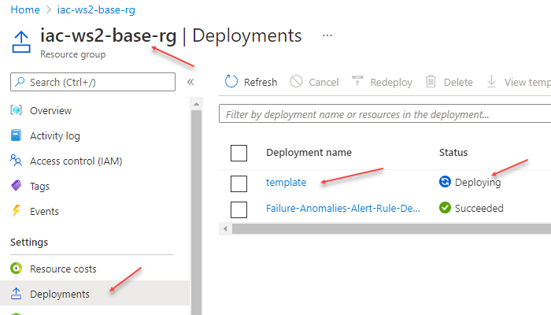
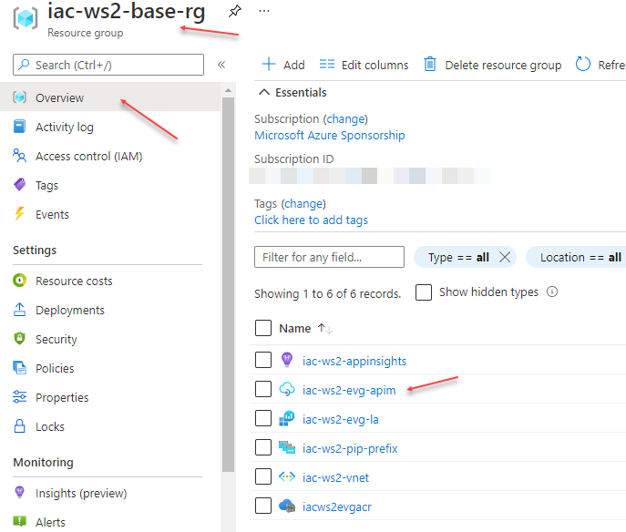

# lab-01 - provision supporting resources

## Estimated completion time - 10 min

We start by provisioning supporting resources such as Log Analytics, Application Insights, API Management, Container Registry and Public IP Prefix. Because supporting resources and AKS resources use different life cycle, they will be deployed to separate Resource Groups. API Management requires Private Virtual Network, we provision it as well.


## Goals

* Provision `Base` resource group
* Provision Private Virtual Network for APIM Management
* Provision Log Analytics workspace
* Provision Application Insight
* Provision Public IP Prefix

## Task #1 - provision supporting resources

We will use the following [naming conventions](../../naming-conventions.md)

Note, because Azure Log Analytics, Azure Container Registry, Azure KeyVault and APIM instance name are global resource and are part of global DNS, they have to be uniquely named. I suggest we prefix them by using your short name.

```bash
WS_PREFIX='iac-ws2'
YOUR_NAME='<USE YOUR NAME>'                 # I am using "evg"
BASE_RG="$WS_PREFIX-base-rg"                # iac-ws2-base-rg
VNET_NAME=$WS_PREFIX-vnet                   # iac-ws2-vnet
LA_NAME="$WS_PREFIX-$YOUR_NAME-la"          # iac-ws2-evg-la
APPINSIGHTS_NAME="$WS_PREFIX-appinsights"   # iac-ws2-appinsights
PREFIX_NAME="$WS_PREFIX-pip-prefix"         # iac-ws2-pip-prefix
ACR_NAME="iacws2${YOUR_NAME}acr"            # iacws2evgacr

# Create base resource group
az group create -g $BASE_RG -l westeurope

# Create APIM VNet with AGW subnet
az network vnet create -g $BASE_RG -n $VNET_NAME --address-prefix 10.10.0.0/16 --subnet-name apim-net --subnet-prefix 10.10.0.0/27

# Create Public IP Prefix
az network public-ip prefix create --length 28 --location westeurope -n $PREFIX_NAME -g $BASE_RG

# Create AppInsight app
az monitor app-insights component create --app $APPINSIGHTS_NAME -l westeurope --kind web -g $BASE_RG --application-type web --retention-time 120

# Create Log Analytics
az monitor log-analytics workspace create -g $BASE_RG -n $LA_NAME

# Create Azure Container Registry
az acr create -g $BASE_RG -n $ACR_NAME --sku Basic
```

## Task #2 - provision API Management

We will use API Management (further APIM) to expose services running in AKS cluster. Since AKS cluster is deployed into private virtual network and will not be publicly accessible, we need to deploy APIM into private virtual network as well. APIM supports 2 ways to deploy to private Vnet:

* internal - the API Management gateway is accessible only from within the virtual network via an internal load balancer. The gateway can access resources within the virtual network
* external - the API Management gateway is accessible from the public internet via an external load balancer. The gateway can access resources within the virtual network

We will use `external` model.


It takes more than 50 mins to provision APIM with VNet integration, therefore we do it as early as possible, so it will be ready when we start working with labs related to APIM. 

We will use `Developer` tier APIM, which provides all functionality included into `Premium`, but there is no SLA and estimated maximum throughput is `500 requests/sec`. It's a perfect choice for testing, workshops and POCs.

The cost of using `Developer` tier is `kr0.59/hour`.

We will use [ARM templates](https://docs.microsoft.com/en-us/azure/azure-resource-manager/templates/overview?WT.mc_id=AZ-MVP-5003837) to provision APIM. 

First, change `publisherEmail` and `userName` properties in `02-aks-advanced-configuration\labs\lab-01\ARM\APIM\parameters.json` file. Since it takes almost an hour to provision APIM, we are not going to wait until it finished. Instead, you can specify email and APIM will notify you when instance is provisioned and ready to be used. 

Note, APIM instance name has to be unique, therefore I suggest to use your name to prefix it. Use `userName` property to set your name.

```bash
# Got to ARM folder
cd 02-aks-advanced-configuration\labs\lab-01\ARM\APIM\

# Validate APIM ARM template. Run this command from lab-02 folder
az deployment group validate -g iac-ws2-base-rg --template-file template.json --parameters parameters.json 

# If no errors, deploy APIM ARM template. APIM deployment takes approx. 50 min
az deployment group create -g iac-ws2-base-rg --template-file template.json --parameters parameters.json 
```

Check that deployment has started. You can do it by navigating to the `Deployments` tab of the `iac-ws2-base-rg` resource group.



If you go to `Overview` tab of the `iac-ws2-base-rg` resource group, you should see APIM instance was already created, but not yet ready to be used.



## Useful links

* [Azure Container Registry documentation](https://docs.microsoft.com/en-us/azure/container-registry/?WT.mc_id=AZ-MVP-5003837)
* [Overview of Log Analytics in Azure Monitor](https://docs.microsoft.com/en-us/azure/azure-monitor/logs/log-analytics-overview?WT.mc_id=AZ-MVP-5003837)
* [What is Application Insights?](https://docs.microsoft.com/en-us/azure/azure-monitor/app/app-insights-overview?WT.mc_id=AZ-MVP-5003837)
* [Public IP address prefix](https://docs.microsoft.com/en-us/azure/virtual-network/public-ip-address-prefix?WT.mc_id=AZ-MVP-5003837)
* [How to use Azure API Management with virtual networks](https://docs.microsoft.com/en-us/azure/api-management/api-management-using-with-vnet?WT.mc_id=AZ-MVP-5003837)
* [API Management pricing](https://azure.microsoft.com/en-us/pricing/details/api-management/?WT.mc_id=AZ-MVP-5003837)
* [What are ARM templates?](https://docs.microsoft.com/en-us/azure/azure-resource-manager/templates/overview?WT.mc_id=AZ-MVP-5003837)

## Next: provision AKS cluster

[Go to lab-02](../lab-02/readme.md)

## Feedback

* Visit the [Github Issue](https://github.com/evgenyb/aks-workshops/issues/15) to comment on this lab. 