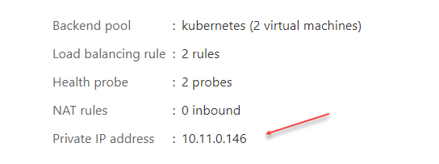

# lab-06 - deploy nginx ingress controller

## Estimated completion time - xx min

## Goals

## Task #1 - deploy nginx ingress controller

Cerate `internal-ingress.yaml` with the following content. 

```yaml
controller:
  replicaCount: 2
  service:
    annotations:
      service.beta.kubernetes.io/azure-load-balancer-internal: "true"
  tolerations:
    - key: "CriticalAddonsOnly"
      operator: "Equal"
      value: "true"
      effect: "NoSchedule"
  nodeSelector: 
    beta.kubernetes.io/os: linux
  affinity: 
    nodeAffinity:
      requiredDuringSchedulingIgnoredDuringExecution:
        nodeSelectorTerms:
        - matchExpressions:
          - key: agentpool
            operator: In
            values: 
            - systempool
  admissionWebhooks:
    patch:
      nodeSelector: 
        beta.kubernetes.io/os: linux    
defaultBackend:
  nodeSelector: 
    beta.kubernetes.io/os: linux
```

Since ingress controller is business critical component, I want to deploy it to the system nodes, therefore I need to configure `tolerations`. I also want to specify more than one replica count, in our case it's two.

```bash
# Add the ingress-nginx repository
helm repo add ingress-nginx https://kubernetes.github.io/ingress-nginx

# Use Helm to deploy an NGINX ingress controller
helm install nginx-ingress ingress-nginx/ingress-nginx \
    --namespace kube-system \
    -f internal-ingress.yaml 

# Check that all pods are up and running. 
kubectl -n kube-system get po -l app.kubernetes.io/name=ingress-nginx
nginx-ingress-ingress-nginx-controller-54b75cbccd-4wl8p   1/1     Running   0          5m14s
nginx-ingress-ingress-nginx-controller-54b75cbccd-t8v5x   1/1     Running   0          5m14s

# Check load balancer external ip
kubectl --namespace kube-system get services -o wide -w nginx-ingress-ingress-nginx-controller
NAME                                     TYPE           CLUSTER-IP    EXTERNAL-IP   PORT(S)                      AGE   SELECTOR
nginx-ingress-ingress-nginx-controller   LoadBalancer   10.0.224.67   10.11.0.146   80:31456/TCP,443:31486/TCP   19m   app.kubernetes.io/component=controller,app.kubernetes.io/instance=nginx-ingress,app.kubernetes.io/name=ingress-nginx
```

It may take a few minutes for the LoadBalancer IP to be available. Initially, `EXTERNAL-IP` column will contain `<pending>`, but when Azure Load Balancer will be cerated and IP address will be assigned, `EXTERNAL-IP` will contain private IP address, in my case it was `10.11.0.146`. 

If you now go to the Azure Portal and navigate to cluster managed resource group (`MC_iac-ws2-blue-rg_iac-ws2-blue-aks_westeurope` or similar), you will find new instance of Azure Load Balancer called `kubernetes-internal`.

```bash
# Get cluster managed resource group
az aks show -g iac-ws2-blue-rg -n iac-ws2-blue-aks  --query nodeResourceGroup -otsv
```


If you open Overview page for this load balancer, you will find private IP address is assigned to it. In my case, it was `10.11.0.146`



No ingress rules have been created yet, so the NGINX ingress controller's default 404 page is displayed if you browse to the internal IP address. Ingress rules are configured in the following tasks.

```bash
# Start curl pod with interactive shell
kubectl run curl -i --tty --rm --restart=Never --image=radial/busyboxplus:curl -- sh

# Try to access our 
[ root@curl:/ ]$ curl http://10.11.0.146
<html>
<head><title>404 Not Found</title></head>
<body>
<center><h1>404 Not Found</h1></center>
<hr><center>nginx</center>
</body>
</html>
[ root@curl:/ ]$ exit
```

## Useful links

* [Create an ingress controller to an internal virtual network in Azure Kubernetes Service (AKS)](https://docs.microsoft.com/en-us/azure/aks/ingress-internal-ip?WT.mc_id=AZ-MVP-5003837)
* [Create an HTTPS ingress controller on Azure Kubernetes Service (AKS)](https://docs.microsoft.com/en-us/azure/aks/ingress-tls?WT.mc_id=AZ-MVP-5003837)
* [Ingress](https://kubernetes.io/docs/concepts/services-networking/ingress/)
* [About Ingress in Azure Kubernetes Service (AKS)](https://vincentlauzon.com/2018/10/10/about-ingress-in-azure-kubernetes-service-aks/)
* [nginx: Default backend](https://kubernetes.github.io/ingress-nginx/user-guide/default-backend/)
* [nginx: Installation with Helm](https://docs.nginx.com/nginx-ingress-controller/installation/installation-with-helm/)
* [Taints and Tolerations](https://kubernetes.io/docs/concepts/scheduling-eviction/taint-and-toleration/)


## Next: 

[Go to lab-07](../lab-07/readme.md)

## Feedback

* Visit the [Github Issue](https://github.com/evgenyb/aks-workshops/issues/xx) to comment on this lab. 