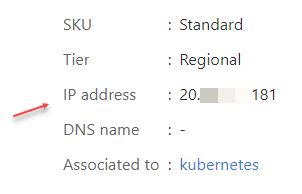
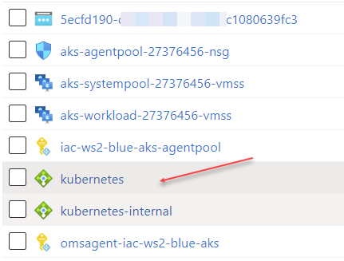
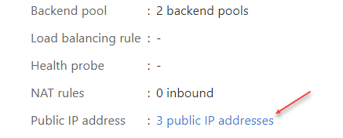
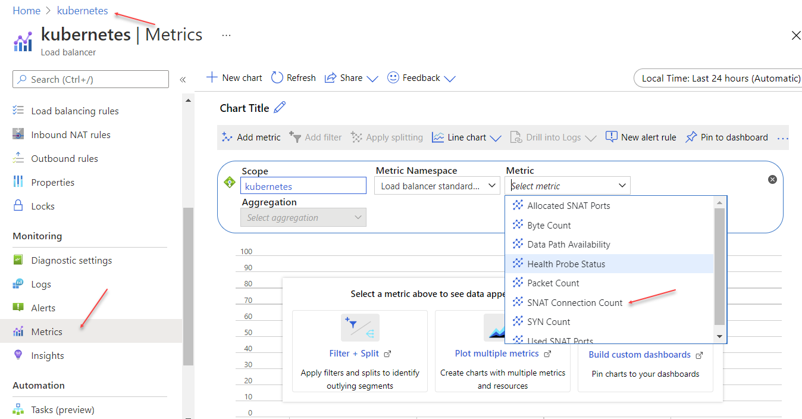
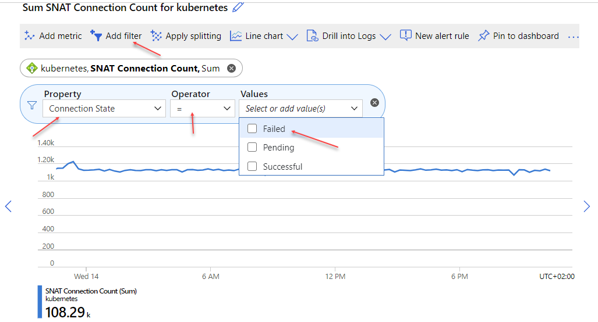
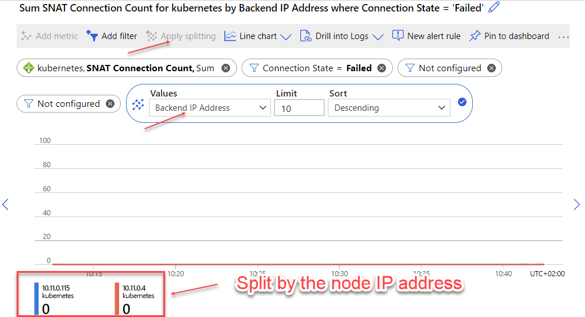
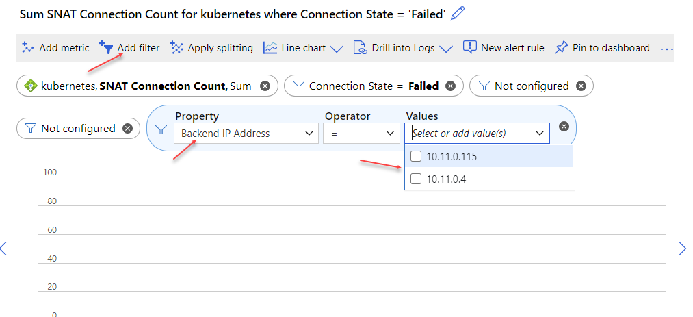
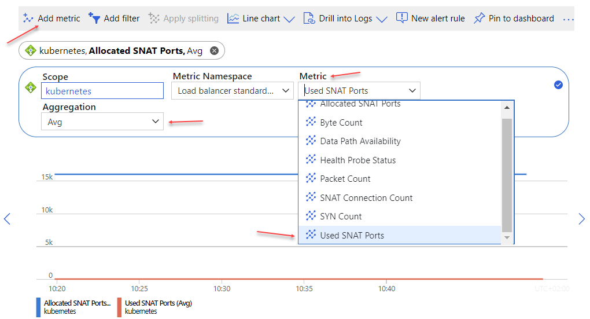

# lab-08 - AKS egress

## Estimated completion time - 15 min

When you use a `Standard SKU` load balancer (default option when you provision AKS cluster), by default the AKS cluster automatically creates a public IP in the AKS-managed infrastructure resource group and assigns it to the load balancer outbound pool.

A public IP created by AKS is considered an AKS managed resource. This means the lifecycle of that public IP is intended to be managed by AKS and requires no user action directly on the public IP resource. 

Alternatively, you can assign your own custom public IPs or public IP prefix. This is very useful if you need to white-list you AKS egress IP address(es) with your integrators.

## Goals

You will learn how to:

* Scale the number of managed outbound public IPs
* Update your cluster with your own outbound public IP
* Update your cluster with your own outbound public IP prefix
* Configure the allocated outbound ports
* How to check SNAT port usage and allocation

## Task #1 - Scale the number of managed outbound public IPs

When using a Standard SKU load balancer with managed outbound public IPs, which are created by default, the AKS cluster automatically creates a public IP in the AKS-managed infrastructure resource group and assigns it to the load balancer outbound pool. 

To get egress IP address, you can go to the AKS managed resource group, select public IP address and check the `IP address` field at the overview page.




Alternatively, you can go to Overview page of the `kubernetes` load balancer




If you prefer to work with cli, you can get the same information by running the following command

```bash
# Get managed resource group name
NODE_RESOURCE_GROUP="$(az aks show -g iac-ws2-blue-rg -n iac-ws2-blue-aks --query nodeResourceGroup -otsv)"

# Get list of public ip from AKS managed resource group
az network public-ip list --resource-group $NODE_RESOURCE_GROUP --query [0].ipAddress --output tsv
```

You can use multiple IP addresses to plan for large-scale scenarios and you can use outbound rules to mitigate SNAT exhaustion prone patterns. Each additional IP address provided by a frontend provides 64k ephemeral ports for Load Balancer to use as SNAT ports.

You can scale the number of managed outbound public IPs using the `load-balancer-managed-ip-count` parameter.

To update an existing cluster, run the following command:

```bash
# Scale the number of managed outbound public IPs to 3
az aks update \
    --resource-group iac-ws2-blue-rg \
    --name iac-ws2-blue-aks \
    --load-balancer-managed-outbound-ip-count 3

# Get list of public ip from AKS managed resource group
az network public-ip list --resource-group $NODE_RESOURCE_GROUP --query [0].ipAddress --output tsv
```

If you check at the portal, you will find 3 public IP resources 


and 3 IP assigned to the Load Balancer.



## Task #2 - Update your cluster with your own outbound public IP

You can assign your own custom public IPs. 

```bash
# Create two Standard Public IP addresses
az network public-ip create -g iac-ws2-blue-rg -n iac-ws2-aks-blue-egress1-pip --sku Standard

# egress2
az network public-ip create -g iac-ws2-blue-rg -n iac-ws2-aks-blue-egress2-pip --sku Standard

# Get public IP IDs
EGRESS_IP1="$(az network public-ip show -g iac-ws2-blue-rg -n iac-ws2-aks-blue-egress1-pip --query id -o tsv)"
EGRESS_IP2="$(az network public-ip show -g iac-ws2-blue-rg -n iac-ws2-aks-blue-egress2-pip --query id -o tsv)"

# Update your cluster with your own outbound public IPs
az aks update \
    --resource-group iac-ws2-blue-rg \
    --name iac-ws2-blue-aks \
    --load-balancer-outbound-ips $EGRESS_IP1,$EGRESS_IP2
```

Note, since now we assigned our own public IP, AKS deleted managed IP addresses from the managed resource group.

```bash
# Get list of public ip from AKS managed resource group
az network public-ip list --resource-group $NODE_RESOURCE_GROUP --query [0].ipAddress --output tsv

# Should be no IP in the list
```

If you check AKS Azure Load Balancer at the portal, you can see that new IP are now assigned to the Load Balancer


## Task #3 - Update your cluster with your own outbound public IP prefix

You can also use public IP prefixes for egress with your Standard SKU load balancer. 

A public IP address prefix is a reserved range of IP addresses in Azure. Public IP address ranges are assigned with a prefix of your choosing. If you create a prefix of `/28`, Azure gives 16 ip addresses from one of its ranges. You don't know which range Azure will assign until you create the range, but the addresses are contiguous. 

The Public IP Prefix is a perfect product if you need to white-list your public IP with your integrators. When you provision public IP Prefix, you know the range of IP addresses in advanced and you can configure entire range as a firewall rule, therefore, when you assign addresses to your resources from a public IP address prefix, firewall rule updates aren't required.

We already provisioned Azure Public IP Prefix during lab #01. 

```bash
# Get public IP prefix ID
PUBLIC_IP_PREFIX_ID="$(az network public-ip prefix show -g iac-ws2-rg -n iac-ws2-pip-prefix --query id -o tsv)"

# Update your cluster with your own outbound public IP prefix
az aks update \
    --resource-group iac-ws2-blue-rg \
    --name iac-ws2-blue-aks \
    --load-balancer-outbound-ip-prefixes $PUBLIC_IP_PREFIX_ID
```

## Task #4 - Configure the allocated outbound ports

Unless otherwise specified, AKS will use the default value of `Allocated Outbound Ports` that Standard Load Balancer defines when configuring it. This value is null on the AKS API or 0 on the SLB API as shown by the below command:

```bash
# Get managed resource group name
NODE_RESOURCE_GROUP="$(az aks show -g iac-ws2-blue-rg -n iac-ws2-blue-aks --query nodeResourceGroup -otsv)"

# Get outbound-rule
az network lb outbound-rule list --resource-group $NODE_RESOURCE_GROUP --lb-name kubernetes -o table
AllocatedOutboundPorts    EnableTcpReset    IdleTimeoutInMinutes    Name             
------------------------  ----------------  ----------------------  ---------------  
0                         True              30                      aksOutboundRule  
```

```bash
# Configure the allocated outbound ports
az aks update \
    --resource-group iac-ws2-blue-rg \
    --name iac-ws2-blue-aks \
    --load-balancer-outbound-ports 4000

# Get outbound-rule
az network lb outbound-rule list --resource-group $NODE_RESOURCE_GROUP --lb-name kubernetes -o table
AllocatedOutboundPorts    EnableTcpReset    IdleTimeoutInMinutes    Name             
------------------------  ----------------  ----------------------  ---------------  
4000                      True              30                      aksOutboundRule  
```

## Task #5 - How to check SNAT port usage and allocation

You should check the following metrics of your load balancer of the AKS cluster:

### SNAT Connection Count

The `SNAT Connection Count` metric filtered by failed `connection state` shows when a SNAT port exhaustion happened. 

In the Azure portal, go to your AKS managed resource group. To get AKS managed resource group, use the following command:

```bash
# Get AKS managed resource group
az aks show -g iac-ws2-blue-rg -n iac-ws2-blue-aks --query nodeResourceGroup -otsv
```



Click `Add filter`, select `Connection state` at the `Property` drop-down lits, use `=` as `Operator` and select `Failed` from the `VAlues` list.



You can split metrics by `Backend IP Address`



And you can filter on particular `Backend IP Address`.



### `Allocated SNAT Ports` and `Used SNAT Ports` metrics

The `Used SNAT Ports` metric tracks how many SNAT ports are being consumed to maintain outbound flows. This indicates how many unique flows are established between an internet source and a backend VM or virtual machine scale set that is behind a load balancer and does not have a public IP address. By comparing the number of SNAT ports you are using with the `Allocated SNAT Ports` metric, you can determine if your service is experiencing or at risk of SNAT exhaustion and resulting outbound flow failure.

Select `Used SNAT Ports` and `Allocated SNAT Ports` as the metric type and `Average` as the aggregation.



Add `Protocol Type` and ``BAckend IP Address` filters, otherwise otherwise we get an aggregated value which led to false assumptions. 


For all metrics, set the time aggregation of the graph to 1 minute to ensure desired data is displayed.

You can then group different metrics into the dashboard.

## Useful links

* [Use a public Standard Load Balancer in Azure Kubernetes Service (AKS)](https://docs.microsoft.com/en-us/azure/aks/load-balancer-standard?WT.mc_id=AZ-MVP-5003837)
* [Control egress traffic for cluster nodes in Azure Kubernetes Service (AKS)](https://docs.microsoft.com/en-us/azure/aks/limit-egress-traffic?WT.mc_id=AZ-MVP-5003837)
* [How do I check my SNAT port usage and allocation?](https://docs.microsoft.com/en-us/azure/load-balancer/load-balancer-standard-diagnostics?WT.mc_id=AZ-MVP-5003837#how-do-i-check-my-snat-port-usage-and-allocation)
* [Using Source Network Address Translation (SNAT) for outbound connections](https://docs.microsoft.com/en-us/azure/load-balancer/load-balancer-outbound-connections?WT.mc_id=AZ-MVP-5003837)
* [az aks update](https://docs.microsoft.com/en-us/cli/azure/aks?view=azure-cli-latest?WT.mc_id=AZ-MVP-5003837#az_aks_update)
* [Public IP address prefix](https://docs.microsoft.com/en-us/azure/virtual-network/public-ip-address-prefix?WT.mc_id=AZ-MVP-5003837)
* [Detecting SNAT port exhaustion on Azure Kubernetes Service](https://www.danielstechblog.io/detecting-snat-port-exhaustion-on-azure-kubernetes-service/)

## Next: Resource Management

[Go to lab-09](../lab-09/readme.md)

## Feedback

* Visit the [Github Issue](https://github.com/evgenyb/aks-workshops/issues/xx) to comment on this lab. 