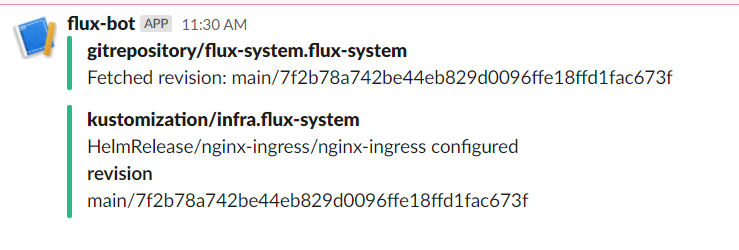

# lab-08 - monorepo as Flux repository structure

## Estimated completion time - xx min

There are multiple ways of structuring your repositories. Monorepo, repository per cluster, single repository with branch per cluster, repository per team or even per application. In this lab we will implement a monorepo for our blue/green clusters environment. 

## Goals

* Implement mono repository for cluster infrastructure
* Use `kustomize` to implement differences between `blue|green` clusters
* Prepare all manifests first, commit them into the repo

## Task #1 - create new github repository

```bash
# Create new iac-ws4-lab08 repository. Make sure that you run this command outside of github repository, otherwise you will get the following error message  'error: remote origin already exists.' and you will need to clone iac-ws4-lab08 to some other folder.
gh repo create iac-ws4-lab08 --private -g VisualStudio -y
Cloning into 'iac-ws4-lab08'...
...

# Go into the iac-ws4-lab08 folder
cd iac-ws4-lab08
```

## Task #2 - connect to the `red` cluster

Let's connect to the clean `red` cluster.

```bash
# Connect to your clue cluster
az aks get-credentials --resource-group iac-ws4-red-rg --name iac-ws4-red-aks --overwrite-existing

# Get list of namespaces and authenticate with Azure AD
kubectl get ns

# You will be prompted to enter devicelogin code.
To sign in, use a web browser to open the page https://microsoft.com/devicelogin and enter the code <...> to authenticate.

NAME              STATUS   AGE
default           Active   14m
kube-node-lease   Active   14m
kube-public       Active   14m
kube-system       Active   14m
```

## Task #3 - create our monorepo folder structure and implement kustomize under iac-ws4-lab08 repository

```txt
    .
    clusters
    ├── iac-ws4-red-aks
    │   ├── slack-alert-provider.yaml
    │   ├── slack-alert.yaml
    │   └── infrastructure.yaml
    infra
    ├── base
    │   ├── nginx-ingress
    │   │   ├── release.yaml
    │   │   ├── namespace.yaml
    │   │   ├── source.yaml
    │   │   └── kustomization.yaml
    │   └── namespaces
    │       ├── namespaces.yaml
    │       └── kustomization.yaml
    └── iac-ws4-red-aks
        ├── patches-nginx-ingress.yaml
        └── kustomization.yaml
```

`clusters` folder contains one folder per cluster and contains `infrastructure.yaml` with `Kustomization` manifest:

```yaml
apiVersion: kustomize.toolkit.fluxcd.io/v1beta1
kind: Kustomization
metadata:
  name: infra
  namespace: flux-system
spec:
  interval: 10m0s
  sourceRef:
    kind: GitRepository
    name: flux-system
  path: ./infra/iac-ws4-red-aks
  prune: true
  validation: client
```

`infra` folder contains `kustomize` implementation of our cluster configuration.
The `base` folder contains folders for `namespaces` and `nginx-ingress`. 
The `nginx-ingress` folder contains manifest files for `HelmRepository`, `HelmRelease` and `namespace`.
The `iac-ws4-red-aks` folder contains `patches-nginx-ingress.yaml` with nginx overlays that we have implemented during `lab #6` and look like this:

Feel free to implement this yourself or just check completed version at the `completed-labs\lab-08` folder.

When it's implemented, commit changes into the `iac-ws4-lab08` repo:

```bash
# Add, commit and push changes
git add -A
git status
git commit -m "Initial commit"
git push
```

## Task #4 - bootstrap Flux into the cluster

```bash
# Export your GitHub access token and username
$Env:GITHUB_TOKEN='ghp_....'
$Env:GITHUB_USER='<your-github-username>'

# Check you have everything needed to run Flux by running 
flux check --pre

# Bootstrap the iac-ws4-blue-aks cluster
flux bootstrap github --owner=$Env:GITHUB_USER --repository=iac-ws4-lab08 --branch=main --personal --path=clusters/iac-ws4-red-aks
```

## Task #5 - create a secret with your Slack incoming webhook

We will create `Slack` alerts as part of cluster configuration. We need to create a `Slack` webhook secret. Use the same URL we used at [lab #7](../lab-07/readme.md)

```bash
# Create a secret with your Slack incoming webhook
kubectl -n flux-system create secret generic slack-url --from-literal=address=your_slack_webhook
secret/slack-url created
```

## Task #6 - upgrade nginx version

Change `infra\iac-ws4-red-aks\patches-nginx-ingress.yaml` file and update nginx chart version to `4.0.6`. 
Commit and push changes and observe changes at the `nginx-ingress` namespace.

```bash
# Watch pod changes at the nginx-ingress namespace
kubectl -n nginx-ingress get po -w
```

In addition to that you should see new alerts at the Slack channel



## Useful links

* [Install Kustomize](https://kubectl.docs.kubernetes.io/installation/kustomize/)

## Next: cleaning up

[Go to lab-09](../lab-09/readme.md)

## Feedback

* Visit the [Github Issue](https://github.com/evgenyb/aks-workshops/issues/xx) to comment on this lab.