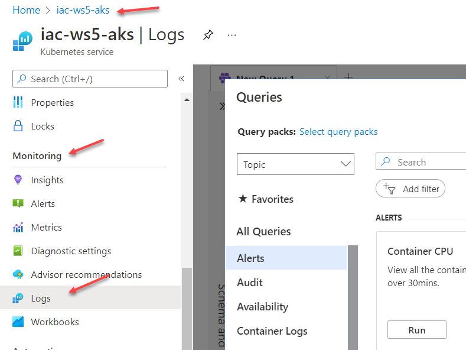
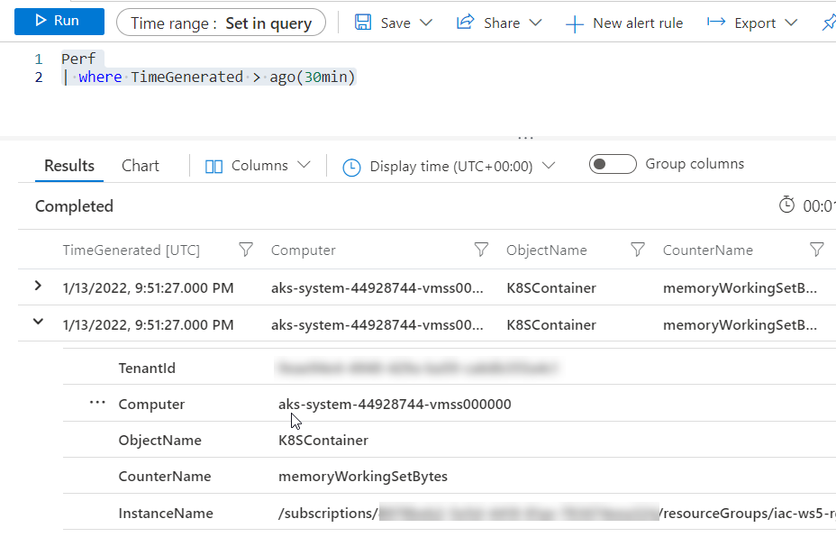
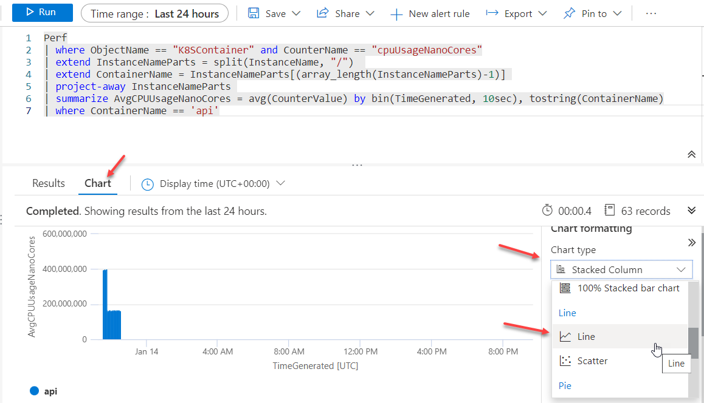
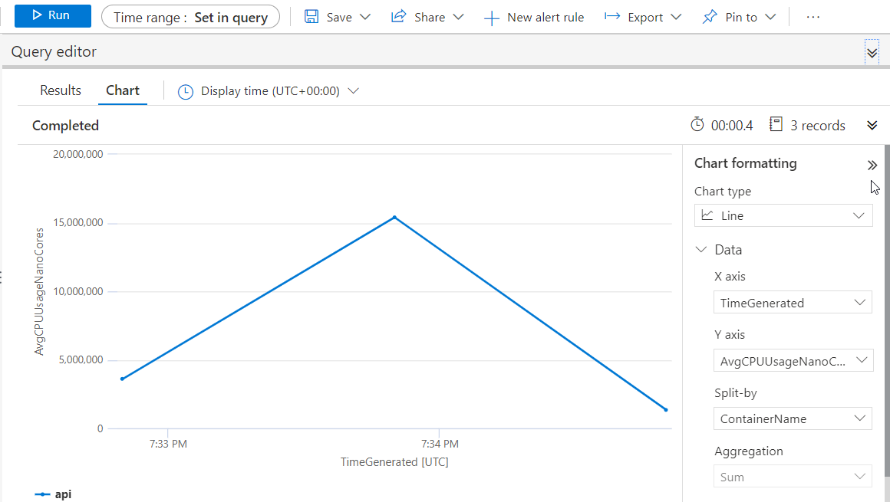
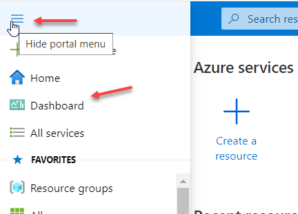
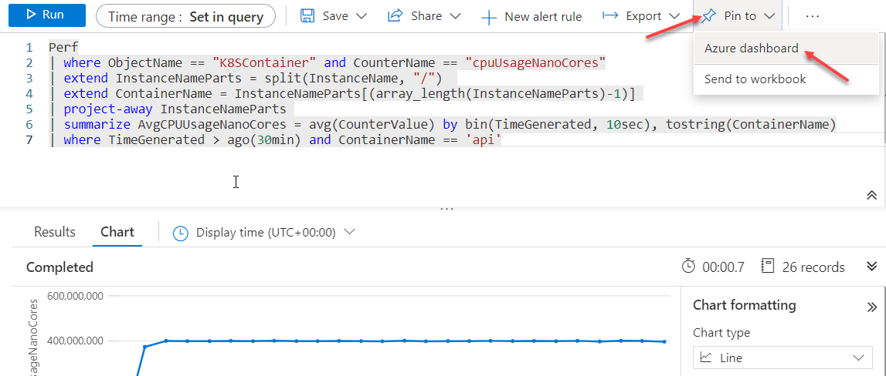
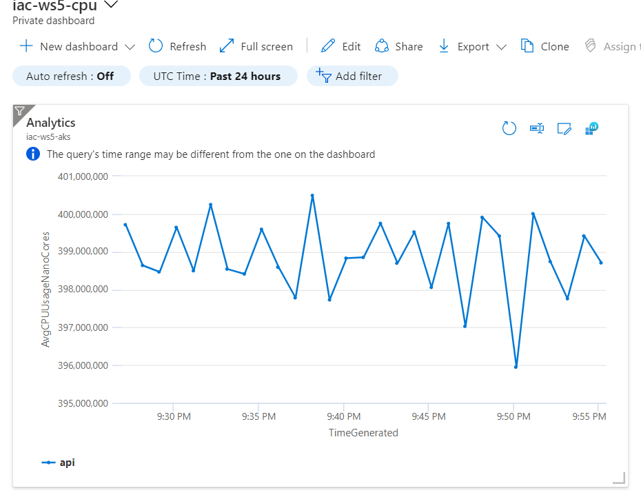
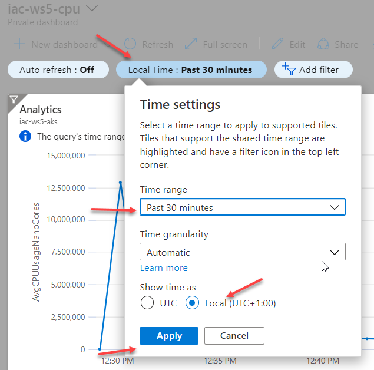
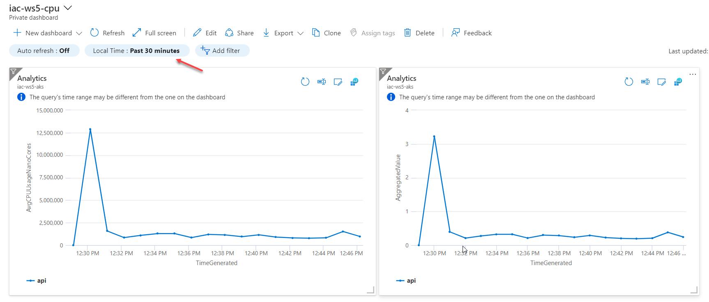
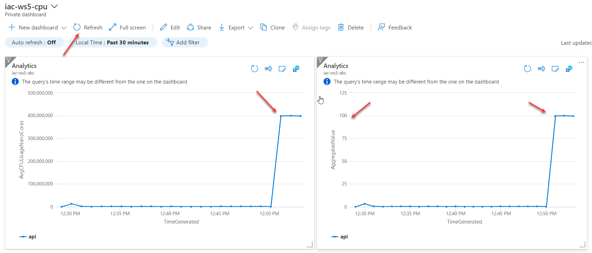

# lab-03 - create monitoring dashboard for test application

## Estimated completion time - xx min

There are multiple ways you can monitor your application metrics in AKS. There will be dedicated workshop that will cover monitoring in more details. For this workshop we will use Azure Log Analytics to visualize our application metrics. In particular, we will monitor the avg. CPU usage. Azure Log Analytics doesn't give a "close to real time" visualization. The data will be updated with approx 2 mins. intervals, but that's good enough for us. 

## Goals

* write [Kusto (KQL) Query]((https://docs.microsoft.com/en-us/azure/data-explorer/kusto/query/?WT.mc_id=AZ-MVP-5003837) for `guinea-pig` CPU usage
* create a line chart to visualize `guinea-pig` CPU usage
* create an Azure Dashboard with different monitoring metrics

## Task #1 - write KQL Query for `guinea-pig` CPU usage

Azure Monitor Logs is based on Azure Data Explorer, and log queries are written using the same `Kusto` query language (KQL). This is a rich language designed to be easy to read and author, so you should be able to start writing queries with some basic guidance.

Log Analytics is primary tool in the Azure portal for editing log queries and interactively analyzing their results. Even if you intend to use a log query elsewhere in Azure Monitor, you'll typically write and test it in Log Analytics before copying it to its final location.

You can start Log Analytics from `Logs` under your AKS instance, from Log Analytics instance, or in the Azure Monitor menu in the Azure portal. 



Copy the following query and paste it into the Logs query editor (where it says `Type your query here or click one of the queries to start`)

```sql
Perf
| where ObjectName == "K8SContainer" and CounterName == "cpuUsageNanoCores"
| extend InstanceNameParts = split(InstanceName, "/")  
| extend ContainerName = InstanceNameParts[(array_length(InstanceNameParts) - 1)] 
| project-away InstanceNameParts 
| summarize AvgCPUUsageNanoCores = avg(CounterValue) by bin(TimeGenerated, 10sec), tostring(ContainerName)
| where ContainerName == 'api'
```

Set `Time range` to 30 min and click `Run`. You should see something similar.


Now let me explain what this query does.

First, it gets data from `Perf` table where `ObjectName` is `K8SContainer` and `CounterName` is `cpuUsageNanoCores`. 

Let's create new query tab and run the following query 

```sql
Perf
| where TimeGenerated > ago(30min)
```

Expand one of the rows and check the `InstanceName` field. It contains resource id that consists of several parts (subscription id, resource group name, resource name etc...) separated by `/`. 




The following code 

```sql
...
| extend InstanceNameParts = split(InstanceName, "/")  
| extend ContainerName = InstanceNameParts[(array_length(InstanceNameParts)-1)] 
...
```

splits all parts of `InstanceName` string into the `InstanceNameParts` array. Then it extracts the last item from this array into `ContainerName`. The last item of the `InstanceName` when `ObjectName` is "K8SContainer" will be container name. In our case, `guinea-pig` pod only contains one container called `api`, therefore we need to add this condition 

```sql
| where ContainerName == 'api' 
```

to filter only metrics coming from our app.

We summarize average values of CPU metrics into `AvgCPUUsageNanoCores` field with `10sec` intervals and group data by container name...

```sql
...
| summarize AvgCPUUsageNanoCores = avg(CounterValue) by bin(TimeGenerated, 10sec), tostring(ContainerName)
...
```
## Task #2 - create a line chart to visualize `guinea-pig` CPU usage

To visualize results, navigate to the `Chart` tab and expand `Chart formatting` panel, located at the right part of the window. By default, data will be presented as a `Stacked column`, but you can select other options from `Chart type` drop-down list. 



In our case, the better representation of the data will be `Line chart`. 




## Task #3 - create an Azure Dashboard for monitoring metrics

The query results and chart will not be auto-refreshed. You need to click `Run` to get new data and you will need to change chart type every time and this is not convenient. To fix that, we can pin chart into `Azure Dashboard`.

First, navigate to Azure Dashboard 



Then click on `New dashboard` and select `Blank dashboard`


Give dashboard a name and click `Save`.


The dashboard is empty and it's fine for now. Now, go back to your Log Analytics query, run it and configure Chart as we did in `Task#2`.

Note, that you have your previous queries in the `Queries history`. 


Find the one you need, click `Run` and configure line chart. Then click `Pin to` and select `Azure dashboard`



At the `Pin to dashboard` window, click `Existing` -> `Private`, select dashboard that you just created and click `Pin`.


Now, navigate to the dashboard and you should see your pod CPU metrics. 




Make sure that you set the time range to `Past 30 min` and `Show time as` is set to `Local`.




## Task #4 - add CPU % chart to the dashboard

We have now implemented CPU usage by `api` container. It shows how much CPU is used in `NanoCores`. Quite often what we want to see is how much % of defined CPU limits are used. Here is the Kusto query that does it. It's much more complicated, queries data from several tables (`Perf` and `KubePodInventory`). It reads `cpuLimitNanoCores` defined for `api` container, reads the actual `cpuUsageNanoCores` and then calculates the %.

```sql
let trendBinSize = 30sec;
let capacityCounterName = 'cpuLimitNanoCores';
let usageCounterName = 'cpuUsageNanoCores';
let applicationName = 'guinea-pig';
KubePodInventory
| where ControllerKind in ('DaemonSet', 'ReplicaSet')
| where Namespace in ('default')
| extend InstanceName = strcat(ClusterId, '/', ContainerName),
    ContainerName = tostring(split(ContainerName, '/')[1]),
    PodName = Name
| where PodStatus in ('Running')
| where PodName startswith applicationName 
| distinct Computer, InstanceName, ContainerName
| join hint.strategy=shuffle (
    Perf
    | where ObjectName == 'K8SContainer'
    | where CounterName == capacityCounterName
    | summarize LimitValue = max(CounterValue) by Computer, InstanceName, bin(TimeGenerated, trendBinSize)
    | project
        Computer,
        InstanceName,
        LimitStartTime = TimeGenerated,
        LimitEndTime = TimeGenerated + trendBinSize,
        LimitValue,
        limitA=100
    )
    on Computer, InstanceName
| join kind=inner hint.strategy=shuffle (
    Perf
    | where ObjectName == 'K8SContainer'
    | where CounterName == usageCounterName
    | project Computer, InstanceName, UsageValue = CounterValue,
limit=100, TimeGenerated
) on Computer, InstanceName
| where TimeGenerated >= LimitStartTime and TimeGenerated < LimitEndTime
| project ContainerName, TimeGenerated, UsagePercent = UsageValue * 100.0 / LimitValue 
| summarize AggregatedValue=max(UsagePercent) by bin(TimeGenerated, trendBinSize), ContainerName

```

Now, the same way as we did at `Task #3`, use this query, create line chart and add it into the `iac-ws5-cpu` Dashboard.

When you finish, your dashboard should look something like this.



## Task #5 - put some load to the application

To get some more metrics, let's put some load to our application by running the following command

```bash
# Generate some load to guinea-pig application
kubectl run -i --tty load-generator --rm --image=busybox --restart=Never -- /bin/sh -c "while sleep 0.01; do wget -q -O- http://guinea-pig-service/api/highcpu; done"
```

This script will run `wget -q -O- http://guinea-pig-service/api/highcpu` command 10 times / sec in the infinitive loop. 

Check application logs 

```bash
# get pod name
kubectl get po
NAME                          READY   STATUS    RESTARTS   AGE
guinea-pig-6c994669b7-hm5kj   1/1     Running   0          39m

# get application logs
kubectl logs guinea-pig-6c994669b7-hm5kj -f
[21:44:54 INF] [guinea-pig.highcpu] - execution took 18 ms.
[21:44:54 INF] [guinea-pig.highcpu] - execution took 39 ms.
[21:44:54 INF] [guinea-pig.highcpu] - execution took 18 ms.
[21:44:54 INF] [guinea-pig.highcpu] - execution took 48 ms.
```
You should see a lot of logs coming.

Now go back to your dashboard and click `Refresh` on the chart.



The metrics from AKS are pushed to Log Analytics approx with 2 mins intervals, so be patient and new data will be shown soon :) 

As you can see from the right chart, with the load we put to our application, it now uses 100% of the allocated CPU limits. 

In the next labs we will see how we can fix it.

## Useful links

* [Kusto Query Language (KQL) overview](https://docs.microsoft.com/en-us/azure/data-explorer/kusto/query/?WT.mc_id=AZ-MVP-5003837)
* [Create a dashboard in the Azure portal](https://docs.microsoft.com/en-us/azure/azure-portal/azure-portal-dashboards?WT.mc_id=AZ-MVP-5003837)
* [Monitoring metrics in AKS](https://vincentlauzon.com/2019/05/09/monitoring-metrics-in-aks/)

## Next: manually scale applications in AKS

[Go to lab-04](../lab-04/readme.md)