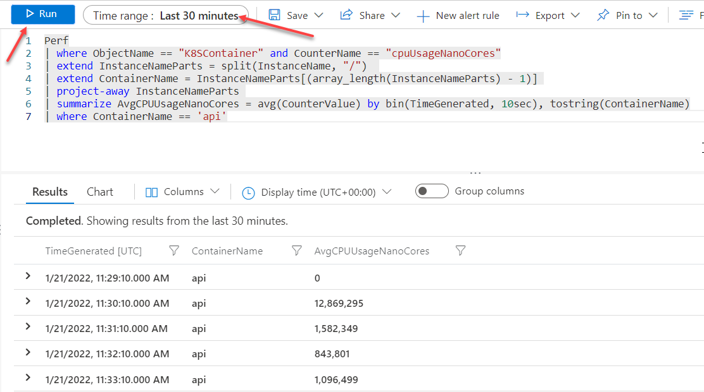

# lab-03 - create monitoring dashboard for test application

## Estimated completion time - xx min

There are multiple ways you can monitor your application metrics in AKS. There will be dedicated workshop that will cover monitoring in more details. For this workshop we will use Azure Log Analytics to visualize our application metrics. In particular, we will monitor the avg. CPU usage. Azure Log Analytics doesn't give a "close to real time" visualization. The data will be updated with approx 2 mins. intervals, but that's good enough for us. 

## Goals

* write [Kusto (KQL) Query]((https://docs.microsoft.com/en-us/azure/data-explorer/kusto/query/?WT.mc_id=AZ-MVP-5003837) for `guinea-pig` CPU usage
* create a line chart to visualize `guinea-pig` CPU usage
* create an Azure Dashboard with different monitoring metrics

## Task #1 - write KQL Query for `guinea-pig` CPU usage

Azure Monitor Logs is based on Azure Data Explorer, and log queries are written using the same `Kusto` query language (KQL). This is a rich language designed to be easy to read and author, so you should be able to start writing queries with some basic guidance.

Log Analytics is primary tool in the Azure portal for editing log queries and interactively analyzing their results. Even if you intend to use a log query elsewhere in Azure Monitor, you'll typically write and test it in Log Analytics before copying it to its final location.

You can start Log Analytics from `Logs` under your AKS instance, from Log Analytics instance, or in the Azure Monitor menu in the Azure portal. 


Copy the following query and paste it into the Logs query editor (where it says `Type your query here or click one of the queries to start`)

```sql
Perf
| where ObjectName == "K8SContainer" and CounterName == "cpuUsageNanoCores"
| extend InstanceNameParts = split(InstanceName, "/")  
| extend ContainerName = InstanceNameParts[(array_length(InstanceNameParts)-1)] 
| project-away InstanceNameParts 
| summarize AvgCPUUsageNanoCores = avg(CounterValue) by bin(TimeGenerated, 10sec), tostring(ContainerName)
| where TimeGenerated > ago(30min) and ContainerName == 'api'
```

Click `Run`. You should see something similar.



Now let me explain what this query does.

First, it gets data from `Perf` table where `ObjectName` is `K8SContainer` and `CounterName` is `cpuUsageNanoCores`. 

Let's create new query tab and run the following query 

```sql
Perf
| where TimeGenerated > ago(30min)
```

Expand one of the rows and check the `InstanceName` field. It contains resource id that consists of several parts (like subscription id, resource group name, resource name etc...) separated by `/`. 


The following code 

```sql
...
| extend InstanceNameParts = split(InstanceName, "/")  
| extend ContainerName = InstanceNameParts[(array_length(InstanceNameParts)-1)] 
...
```

splits all parts of `InstanceName` string into the `InstanceNameParts` array. Then it extracts the last item from this array into `ContainerName`. The last item of the `InstanceName` when `ObjectName` is "K8SContainer" will be container name. In our case, `guinea-pig` pod only contains one container called `api`, therefore we need to add this condition 

```sql
| where ContainerName == 'api' ...
```

to filter only metrics coming from our app.

To get logs for the last 30 mins, we use the following condition.

```sql
... and TimeGenerated > ago(30min) 
```

We summarize average values of CPU metrics into `AvgCPUUsageNanoCores` field with `10sec` intervals and group data by container name...

```sql
...
| summarize AvgCPUUsageNanoCores = avg(CounterValue) by bin(TimeGenerated, 10sec), tostring(ContainerName)
...
```


## Useful links

* [Kusto Query Language (KQL) overview](https://docs.microsoft.com/en-us/azure/data-explorer/kusto/query/?WT.mc_id=AZ-MVP-5003837)


## Next: create monitoring dashboard for test application

[Go to lab-04](../lab-04/readme.md)