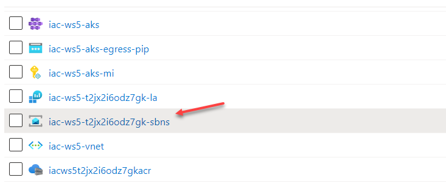
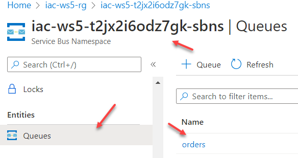

# lab-09 - use KEDA to autoscale application processing Azure Service Bus Queue

To show how KEDA works in action, we will use one of the examples provided by KEDA team - [.NET Core worker processing Azure Service Bus Queue scaled by KEDA with connection strings](https://github.com/kedacore/sample-dotnet-worker-servicebus-queue/blob/main/connection-string-scenario.md). 

We will literally use it as a tutorial. The only thing I did, was that included Azure resources required for this sample to work into workshop's provisioning template. If everything went as planned during [lab-01](..\lab-01\readme.md), you should have the following resources provisioned under `iac-ws5-rg`:

* Azure Service Bus. Note that the name contains the same unique id as Log Analytics and Azure Container Registry resources.


* `orders` queue  


* `orders` queue is configured with three Authorization rules - `order-consumer`, `keda-monitor`, `order-generator` with different access rights


## Task #1 - download and install dotnet core 3.1, `jq` and `base64` 

The console application that we will use to send messages to the Azure Service Bus is dotnet core 3.0 console app. To build it locally, you need to install dotnet core 3.0 to your PC. 

Go to [Download .NET Core 3.1 Runtime](https://dotnet.microsoft.com/en-us/download/dotnet/3.1/runtime) page, select OS that you use, download and install SDK.

To make our life easier, we will use two cli tools called [jq](https://stedolan.github.io/jq/) - a lightweight and flexible command-line JSON processor, and [base64](https://rtner.de/software/base64.html) - little tool that converts binary data to Base64 encoding and vice versa. 

If you are running on linux or mac, most likely you already have them installed. On Windows, use [chocolatey](https://chocolatey.org/install) to install them. Note, you have to run your Powershell shell as Administrator when run `choco install` commands.  

```bash
# Install jq
choco install jq

# Test jq
echo '{"foo": "bar"}' | jq . -r

# Install base64 
choco install base64

# Test base64 
echo foobar | base64

```

## Task #2 - deploy order processor

First, create new namespace

```bash
# Create keda-dotnet-sample namespace
kubectl create namespace keda-dotnet-sample
```
Create new `deploy-app.yaml` file and copy content from the original [deploy-app.yaml](https://github.com/kedacore/sample-dotnet-worker-servicebus-queue/blob/main/deploy/connection-string/deploy-app.yaml) file.

Get base64 encoded connection string for `order-consumer` key. 

For the `az cli` commands below you need to use your Azure Service Bus namespace instance name, because it's globally unique. You can either copy it from Azure Portal, or use this `az cli` command to query it.

```bash
az servicebus namespace list -g iac-ws5-rg | jq .[].name -r
```

Use it for all further `az servicebus` commands instead of `iac-ws5-<YOUR-UNUQUE-ID>-sbns`.

```bash
# Get base64 encoded connection string
az servicebus queue authorization-rule keys list --resource-group iac-ws5-rg --namespace-name iac-ws5-<YOUR-UNUQUE-ID>-sbns --queue-name orders --name order-consumer | jq .primaryConnectionString -r | base64 -n 0
```

Copy the above string and replace `<base64-encoded-connection-string>` in `deploy-autoscaling.yaml` file with it.
Save `deploy-app.yaml` file and deploy it into `keda-dotnet-sample` namespace.

```bash
# Deploy order-processor application
kubectl apply -f deploy-app.yaml -n keda-dotnet-sample

# Check deployment status
kubectl get deployments --namespace keda-dotnet-sample -o wide
NAME              READY   UP-TO-DATE   AVAILABLE   AGE     CONTAINERS        IMAGES                                                          SELECTOR
order-processor   1/1     1            1           2m20s   order-processor   ghcr.io/kedacore/sample-dotnet-worker-servicebus-queue:latest   app=order-processor

# Get order-processor logs 
kubectl -n keda-dotnet-sample logs -l app=order-processor
[21:57:31]info: Keda.Samples.Dotnet.OrderProcessor.OrdersQueueProcessor[0]
      Starting message pump on queue orders in namespace iac-ws5-<YOUR-UNUQUE-ID>-sbns.servicebus.windows.net
[21:57:31]info: Keda.Samples.Dotnet.OrderProcessor.OrdersQueueProcessor[0]
      Message pump started
[21:57:31]info: Microsoft.Hosting.Lifetime[0]
      Application started. Press Ctrl+C to shut down.
[21:57:31]info: Microsoft.Hosting.Lifetime[0]
      Hosting environment: Production
[21:57:31]info: Microsoft.Hosting.Lifetime[0]
      Content root path: /app
```

Check that there are no errors in the log and application is able to connect to Azure Service Bus (Starting message pump on queue orders in namespace iac-ws5-<your-unique-id>-sbns.servicebus.windows.net

## Task #3 - deploy KEDA autoscaling

Create new `deploy-autoscaling.yaml` file and copy content from the original [deploy-autoscaling.yaml](https://github.com/kedacore/sample-dotnet-worker-servicebus-queue/blob/main/deploy/connection-string/deploy-autoscaling.yaml) file.

Get base64 encoded connection string for `keda-monitor` key. 

```bash
# Get base64 encoded connection string
az servicebus queue authorization-rule keys list --resource-group iac-ws5-rg --namespace-name iac-ws5-<YOUR-UNUQUE-ID>-sbns --queue-name orders --name keda-monitor | jq .primaryConnectionString -r | base64 -n 0
```

Copy the above string and replace `<base64-encoded-connection-string>` in `deploy-autoscaling.yaml` file with it.
Save `deploy-autoscaling.yaml` file and deploy it into `keda-dotnet-sample` namespace.

```bash
# Deploy autoscaling 
kubectl apply -f deploy-autoscaling.yaml -n keda-dotnet-sample

# Check order-processor deployment status
kubectl get deployments --namespace keda-dotnet-sample
NAME              READY   UP-TO-DATE   AVAILABLE   AGE
order-processor   0/0     0            0           15m
```
As you can see, there are no pods available. KEDA autoscaler scaled it down, because queue is empty and there is no work to do.

## Task #4 - publish messages to the queue

If you use Windows Terminal, to get a better experience, I recommend you to setup two terminals side by side. Use left one to run your commands amd use right one to watch status changes done to `order-processor` deployment. Run the following command in your right terminal `kubectl -n keda-dotnet-sample get deployment order-processor -w`.

Follow the instruction described in this tutorial https://github.com/kedacore/sample-dotnet-worker-servicebus-queue/blob/main/connection-string-scenario.md#publishing-messages-to-the-queue

```
# Clone the repo
git clone https://github.com/kedacore/sample-dotnet-worker-servicebus-queue
cd sample-dotnet-worker-servicebus-queue
```
Use the following command to get Connection string to insert into `Program.cs` file

```bash
# Get order-generator connection string
az servicebus queue authorization-rule keys list --resource-group iac-ws5-rg --namespace-name iac-ws5-<YOUR-UNUQUE-ID>-sbns --queue-name orders --name order-generator | jq .primaryConnectionString -r 
```
Lines 12 and 13 in your `Program.cs` should look something similar to 

```c#
...
 private const string QueueName = "orders"; // 
 private const string ConnectionString = "Endpoint=sb://iac-ws5-<your-unique-id>-sbns.servicebus.windows.net/;SharedAccessKeyName=order-generator;SharedAccessKey=<your-shared-key>;EntityPath=orders";
 ...
```

Build and run the order generator (if you have two terminal setup, run it in the left window)

```bash
# Run the order generator
dotnet run --project .\src\Keda.Samples.Dotnet.OrderGenerator\Keda.Samples.Dotnet.OrderGenerator.csproj

Let's queue some orders, how many do you want?
300
Queuing order 86637d00-0265-4d49-a97e-a8826293a0a6 - A Hat for Eda Bernier
Queuing order 88dc7010-820b-4e44-b6b3-0b735399920b - A Shirt for Marty Dickens
Queuing order 15c4b820-e911-4910-8892-1f1d03198119 - A Table for Melisa Russel
...
```


If you see something similar to this message

```bash
dotnet run --project .\src\Keda.Samples.Dotnet.OrderGenerator\Keda.Samples.Dotnet.OrderGenerator.csproj

It was not possible to find any compatible framework version
The framework 'Microsoft.NETCore.App', version '3.1.0' (x64) was not found.
  - The following frameworks were found:
      5.0.13 at [C:\Program Files\dotnet\shared\Microsoft.NETCore.App]
      6.0.1 at [C:\Program Files\dotnet\shared\Microsoft.NETCore.App]

You can resolve the problem by installing the specified framework and/or SDK.

The specified framework can be found at:
  - https://aka.ms/dotnet-core-applaunch?framework=Microsoft.NETCore.App&framework_version=3.1.0&arch=x64&rid=win10-x64

```

then you haven't installed dotnet core to your PC. Go back to `Task #1`.

You may also have some runtime exception similar to this one 

```bash
dotnet run --project .\src\Keda.Samples.Dotnet.OrderGenerator\Keda.Samples.Dotnet.OrderGenerator.csproj
Let's queue some orders, how many do you want?
300
Unhandled exception. System.FormatException: The connection string could not be parsed; either it was malformed or contains no well-known tokens.
   at Azure.Messaging.ServiceBus.Core.ConnectionStringParser.Parse(String connectionString)
   at Azure.Messaging.ServiceBus.ServiceBusConnection..ctor(String connectionString, ServiceBusClientOptions options)
   at Azure.Messaging.ServiceBus.ServiceBusClient..ctor(String connectionString, ServiceBusClientOptions options)
```

In this case check that connection string is in correct format inside `Program.cs` file.

If no errors, the order generator will start publishing messages into Azure Service Bus queue and eventually KEDA will scale up `order-processor` deployment to 4, then 6 and eventually 10 replicas.

```bash
kubectl -n keda-dotnet-sample get deployment order-processor -w
NAME              READY   UP-TO-DATE   AVAILABLE   AGE
order-processor   0/0     0            0           32m
order-processor   0/1     0            0           37m
order-processor   0/1     0            0           37m
order-processor   0/1     0            0           37m
order-processor   0/1     1            0           37m
order-processor   1/1     1            1           37m
order-processor   1/4     1            1           37m
order-processor   1/4     1            1           37m
order-processor   1/4     1            1           37m
order-processor   1/4     4            1           37m
order-processor   2/4     4            2           37m
order-processor   3/4     4            3           37m
order-processor   4/4     4            4           37m
```

You can also check order-processor logs

```bash
kubectl -n keda-dotnet-sample logs -l app=order-processor -f
[22:38:19]info: Keda.Samples.Dotnet.OrderProcessor.OrdersQueueProcessor[0]
      Received message 1a27fb638002497bad82714fcd5709ca with body {"Id":"8e694daa-e0f2-437b-9d91-e87726343557","Amount":800628481,"ArticleNumber":"Tuna","Customer":{"FirstName":"Lizeth","LastName":"Tremblay"}}
[22:38:19]info: Keda.Samples.Dotnet.OrderProcessor.OrdersQueueProcessor[0]
      Processing order 8e694daa-e0f2-437b-9d91-e87726343557 for 800628481 units of Tuna bought by Lizeth Tremblay
[22:38:21]info: Keda.Samples.Dotnet.OrderProcessor.OrdersQueueProcessor[0]
      Order 8e694daa-e0f2-437b-9d91-e87726343557 processed
[22:38:21]info: Keda.Samples.Dotnet.OrderProcessor.OrdersQueueProcessor[0]
      Message 1a27fb638002497bad82714fcd5709ca processed
[22:38:21]info: Keda.Samples.Dotnet.OrderProcessor.OrdersQueueProcessor[0]
      Received message cb5ba37cc285408fb827a92c8b36a0c9 with body {"Id":"3676e5de-b97a-4d62-8970-040bc4e21e82","Amount":-1538897928,"ArticleNumber":"Pants","Customer":{"FirstName":"Max","LastName":"Ernser"}}
```

## Useful links

* [Kubernetes Event-driven Autoscaling](https://keda.sh/)
* [The KEDA Documentation](https://keda.sh/docs/2.5/)
* [KEDA samples](https://github.com/kedacore/samples)
* [KEDA Custom Resources](https://keda.sh/docs/2.5/concepts/#custom-resources-crd) 

## Next: cleaning up resources

[Go to lab-10](../lab-10/readme.md)